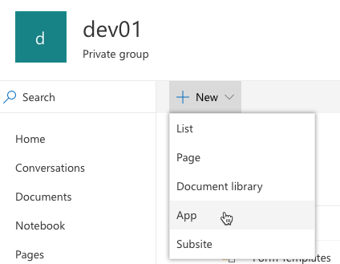
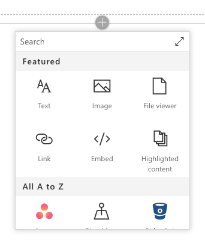

# Deploying SPFx Solutions

In this demo you will create a simple SharePoint Framework (SPFx) client-side web part that will be used to try out different deployment configurations.

> NOTE: The instructions below assume you are using v1.9.1 of the SharePoint Framework Yeoman generator.

1. Open a command prompt and change to the folder where you want to create the project.
1. Run the SharePoint Yeoman generator by executing the following command:

    ```shell
    yo @microsoft/sharepoint
    ```

    Use the following to complete the prompt that is displayed:

    - **What is your solution name?**: DeploymentDemo
    - **Which baseline packages do you want to target for your component(s)?**: SharePoint Online only (latest)
    - **Where do you want to place the files?**: Use the current folder
    - **Do you want to allow the tenant admin the choice of being able to deploy the solution to all sites immediately without running any feature deployment or adding apps in sites?**: No
    - **Will the components in the solution require permissions to access web APIs that are unique and not shared with other components in the tenant?**: No
    - **Which type of client-side component to create?**: WebPart
    - **What is your Web part name?**: Deployment Demo
    - **What is your Web part description?**: Deployment Demo description
    - **Which framework would you like to use?**: No JavaScript framework

    After provisioning the folders required for the project, the generator will install all the dependency packages using NPM.

1. Create a deployment package for the project:
    1. When NPM completes downloading all dependencies, build the project by running the following command on the command line from the root of the project:

        ```shell
        gulp build
        ```

    1. Next, create a production bundle of the project by running the following command on the command line from the root of the project:

        ```shell
        gulp bundle --ship
        ```

    1. Finally, create a deployment package of the project by running the following command on the command line from the root of the project:

        ```shell
        gulp package-solution --ship
        ```

1. Deploy the package to a SharePoint site.
    1. In a browser, navigate to your SharePoint tenant's App Catalog site.
    1. Select the **Apps for SharePoint** link in the left-hand navigation.
    1. Drag the package created in the previous steps, located in the project's **./sharepoint/solution/deployment-demo.sppkg**, into the **Apps for SharePoint** library.
    1. SharePoint will launch a dialog asking if you want to trust the package:

        

        Select **Deploy**.

1. Install the SharePoint package in a site collection:
    1. Navigate to an existing site collection, or create a new one.
    1. Select **Site Contents** from the left-hand navigation.
    1. From the **New** menu, select **App**.

        

    1. Locate the solution you previously deployed and select it.

        

    1. SharePoint will start to install the application. At first it will be grayed out, but after a few moments you should see it listed like the following picture:

        

1. Add the web part to a page:
    1. Navigate to a SharePoint page.
    1. Put it in edit mode by selecting the **Edit** button in the top-right portion of the content area on the page.
    1. Select the web part icon button to open the list of available web parts:

        

    1. Select the expand icon, a diagonal line with two arrows in the top right corner, to expand the web part toolbox:
    1. Scroll to the bottom, locate and select the **Deployment Demo** web part.

        

1. Examine the deployed web part files:
    1. Once the page loads, open the browser's developer tools and navigate to the **Sources** tab.
    1. Refresh the page and examine where the JavaScript bundle is being hosted.

        If you have not enabled the Office 365 CDN then the bundle will be hosted from a document library named **ClientSideAssets** in the app catalog site.

        

        If you have enabled the Office 365 CDN then the bundle will be automatically hosted from the CDN. 

        

### Remove the deployed web part

1. Remove the web part from the page:
    1. Select the trash can icon in the toolbar to the left of the web part:

        

1. Uninstall the SharePoint package:
    1. Navigate back to the site's **Site Contents** page.
    1. Select the context menu for the installed package and select the **Remove** action:

        

1. Retract the SharePoint package:
    1. Navigate back to the tenant's App Catalog site.
    1. Select the **Apps for SharePoint** option from the left-hand navigation.
    1. Select the menu for the deployed package, open the extra actions and then select **Delete** as shown in the following figure:

        
