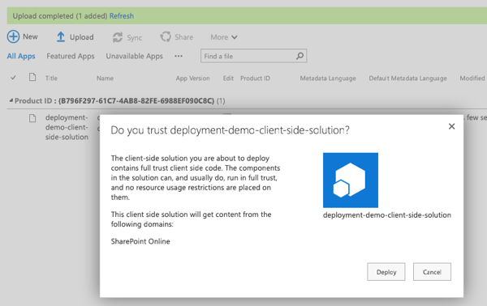

# Site Collection App Catalogs

In the previous demo you worked with the Tenant-scoped App Catalog. In this demo you will see how to enable a Site Collection-scoped App Catalog and deploy and app to it.

1. Enable a site collection scoped app catalog:
    1. Navigate to an existing site collection.
    1. Select **Site Contents** from the left-hand navigation.
    1. In the list of lists on the **Site Contents** page, look for a library named **Apps for SharePoint**. If it is present, you can skip to the next step of this demo. Otherwise you will need to create the site collection-scoped app catalog.
    1. Depending on your development platform, create a new site collection scoped app catalog:

        If you are using Windows, you can use the [SharePoint Online Management Shell](https://www.microsoft.com/download/details.aspx?id=35588) PowerShell module:

        ```shell
        # login as a tenant admin to the SharePoint Online tenant admin site
        # replace the URL shown below with the URL of your SharePoint Online tenant admin site
        PS> Connect-SPOService -Url https://contoso-admin.sharepoint.com

        # create site collection app catalog
        # replace the URL shown below with the URL of a site collection within your SharePoint Online tenant
        PS> Add-SPOSiteCollectionAppCatalog -Site https://contoso.sharepoint.com/sites/dev01
        ```

        Alternatively, you can use the [Office 365 CLI](https://pnp.github.io/office365-cli/):

        ```shell
        # login as a tenant admin to the SharePoint Online tenant admin site
        # replace the URL shown below with the URL of your SharePoint Online tenant admin site
        $ spo connect https://contoso-admin.sharepoint.com

        # create site collection app catalog
        # replace the URL shown below with the URL of a site collection within your SharePoint Online tenant
        $ spo site appcatalog add --url https://contoso.sharepoint/sites/dev01
        ```

        After executing the command to create a new site collection app catalog, you should see the library **Apps for SharePoint** in the **Site Contents** page within a few moments.

1. Upload and deploy a site to the site collection app catalog:
    1. Locate the ***.sppkg** you created in the previous demo.

        > NOTE: You can find the final built solution from the first demo in the [Demos/01-deployment](../../Demos/01-deployment) folder.

    1. In a browser, navigate to the site collection that you created the site collection app catalog in from the previous step.
    1. Select **Site Contents** in the left-hand navigation.
    1. Select the library **Apps for SharePoint** in the list of site contents.
    1. Drag the ***.sppkg** created in the previous steps, into the **Apps for SharePoint** library.
    1. SharePoint will launch a dialog asking if you want to trust the package:

        

        Select **Deploy**.

1. Verify the the SharePoint package is only available for installation in the current site collection:
    1. Select **Site Contents** from the left-hand navigation.
    1. From the **New** menu, select **App**.

        

    1. Locate the solution you previously deployed and select it.

        

    1. Now, navigate to a different site collection.
    1. Select **Site Contents** from the left-hand navigation.
    1. From the **New** menu, select **App**.

        

    1. Notice the solution you previously deployed to a different site collection is not shown.

        
