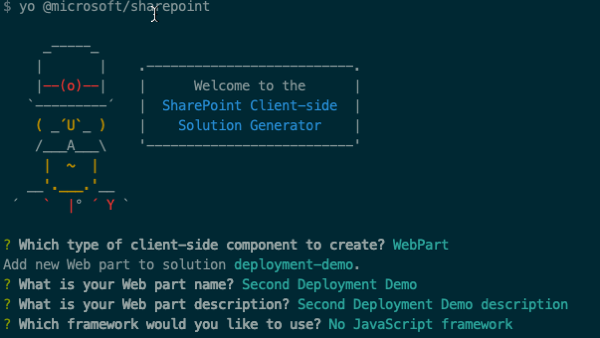
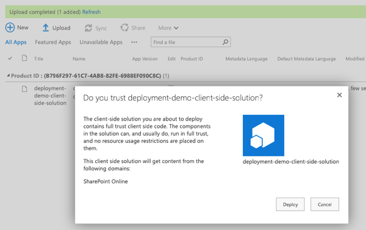
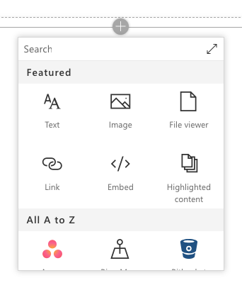
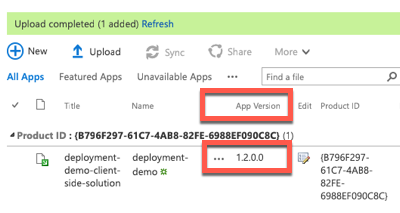
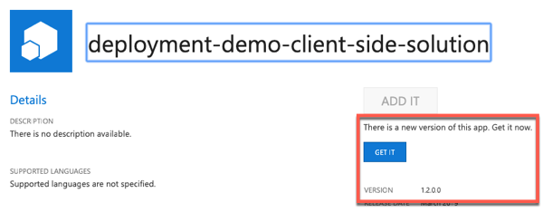
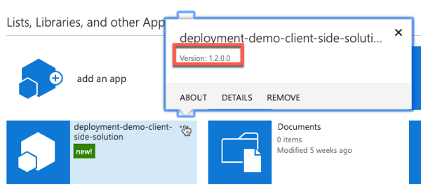
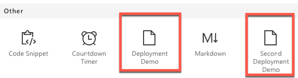

# Working with SPFx Project and Component Versions

In this demo you will learn how to change the various version numbers in SharePoint Framework components and packages, as well as how this impacts your deployments.

> **NOTE:** This exercise assumes you completed both exercise 1 and exercise 2. That is, you've deployed the package to a site collection-scoped app catalog. You can locate the solution from exercise 1 in the [Demos/01-deployment](../../Demos/01-deployment) folder.
>
> **NOTE:** Regardless if you decide to change the version number of the SPFx component or package as demonstrated in this exercise, when you upload a new package all existing code will be updated to what is in that package.


### Update the Component's Version Number

*In the previous demo you deployed a SPFx package that contained a single web part. The version of that web part was unchanged from the default version included in a newly created component: 0.0.1.*

1. Examine the existing component's version number:
    1. Locate and open the file **./src/webparts/deploymentDemo/DeploymentDemoWebPart.manifest.json**.
    1. Notice the `version` property of the component is set to `*`. This means that the version number will be pulled from the project's **package.json** file. 

        > You have the option to make this value unique by replacing the `*` to use a custom value.

    1. Locate and open the file **pacakge.json** in the root of the project.
    1. Notice the `version` property of the project is set to `0.0.1`. This is the version all components will use.

1. Update the version number of the component:
    1. Change the `version` property in the **package.json** file to `0.0.2` and save your changes.
    1. Build & bundle the project to see the new version. Do this by executing the following two commands in the root of the project:

        ```shell
        gulp build

        gulp bundle --ship
        ```

    1. Open the component's manifest file **./dist/`<guid>`.manifest.json**.
    1. Notice the `version` property of the component's manifest is now `0.0.2`.

### Add a new Component to the Package

1. Execute the following in the command line from the root of the SharePoint project:

    ```shell
    yo @microsoft/sharepoint
    ```

    When prompted, use the following options:

    - **Which type of client-side component to create?**: WebPart
    - **What is your Web part name?**: Second Deployment Demo
    - **What is your Web part description?**: Second Deployment Demo description
    - **Which framework would you like to use?**: No JavaScript framework

    

1. Update the deployment package for the project:
    1. Build the project by running the following command on the command line from the root of the project:

        ```shell
        gulp build
        ```

    1. Next, create a production bundle of the project by running the following command on the command line from the root of the project:

        ```shell
        gulp bundle --ship
        ```

    1. Finally, create a deployment package of the project by running the following command on the command line from the root of the project:

        ```shell
        gulp package-solution --ship
        ```

1. Deploy the package to a SharePoint site.
    1. In a browser, navigate to the site collection where you previously deployed the package.
    1. Select the **Apps for SharePoint** link in the left-hand navigation.
    1. Drag the package created in the previous steps, located in the project's **./sharepoint/solution/deployment-demo.sppkg**, into the **Apps for SharePoint** library.
    1. SharePoint will launch a dialog asking if you want to trust the package:

        

        Select **Deploy**.

    1. After the package has been deployed, notice the version of the package is still version 1.0.0.0.

> Because you previously installed this package, there is nothing to install.

1. Navigate over to a page that you can edit to add a web part.
    1. Put it in edit mode by selecting the **Edit** button in the top-right portion of the content area on the page.
    1. Select the web part icon button to open the list of available web parts:

        

    1. Select the expand icon, a diagonal line with two arrows in the top right corner, to expand the web part toolbox:
    1. Scroll to the bottom and notice the new web part is not listed. This is because web parts are added to the web part gallery by activating a feature.

> When the package was deployed, the features within it were activated. Without versioning the package, SharePoint does not see any changes within it, thus it does not activate or reactivate any new or existing features.

### Update the SharePoint Package Version

1. Locate and open the **./config/package-solution.json** file.
1. Within the `solution` object, update the `version` property to `1.2.0.0`.
1. Update the deployment package for the project:
    1. Build the project by running the following command on the command line from the root of the project:

        ```shell
        gulp build
        ```

    1. Next, create a production bundle of the project by running the following command on the command line from the root of the project:

        ```shell
        gulp bundle --ship
        ```

    1. Finally, create a deployment package of the project by running the following command on the command line from the root of the project:

        ```shell
        gulp package-solution --ship
        ```

1. Deploy the package to a SharePoint site.
    1. In a browser, navigate to the site collection where you previously deployed the package.
    1. Select the **Apps for SharePoint** link in the left-hand navigation.
    1. Drag the package created in the previous steps, located in the project's **./sharepoint/solution/deployment-demo.sppkg**, into the **Apps for SharePoint** library.
    1. SharePoint will launch a dialog asking if you want to trust the package:

        

        Select **Deploy**.

    1. After the package has been deployed, notice the version of the package is now 1.2.0.0:

        

1. Now that the package has been uploaded, you now need to upgrade the installed app.
    1. Select the **Site Contents** link in the left-hand navigation.
    1. If you are not currently in the classic mode, select the **Return to classic SharePoint** link in the bottom-left of the screen.
    1. Use the mouse to hover over the tile for the installed app. Notice the version is still 1.0.0.0.

        

    1. Select the **About** link.
    1. On the app details page, notice there is a message that a new version of the app is available and the version is 1.2.0.0.

        

    1. Select the **Get It** button to upgrade the application.
    1. SharePoint will take you back to the **Site Contents** page. Wait for the app to complete it's upgrade process and verify the new version has been installed:

        

    1. Now when you go back to a page to add the new web part, you will see the second web part show up in the web part toolbox as shown in the following image:

        