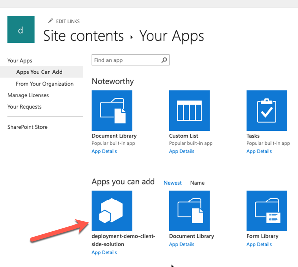
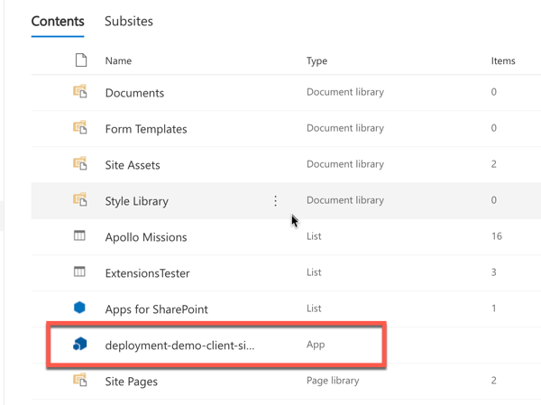
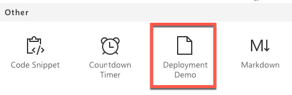
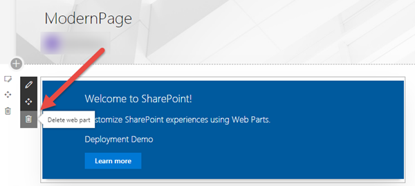
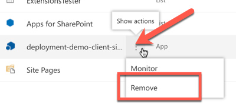
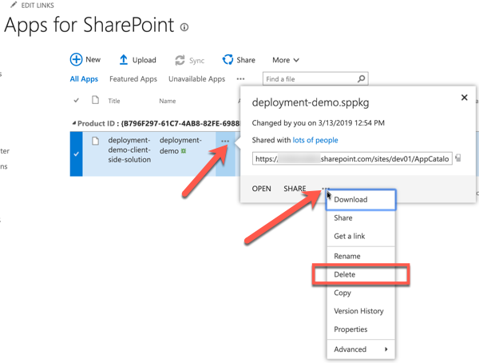
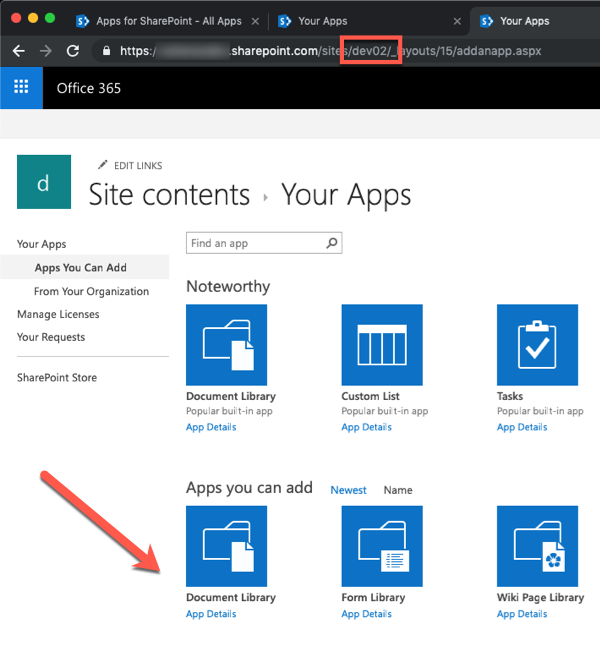
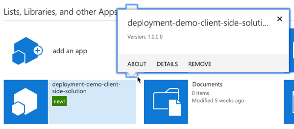
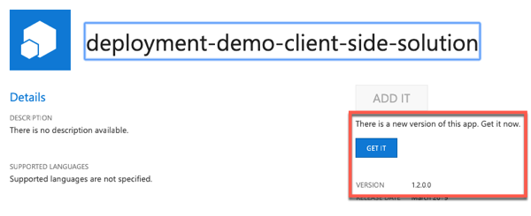
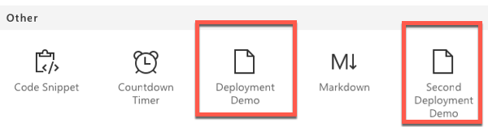

## Lab - Deploying SharePoint Framework Components to Production

In this lab you will learn how to deploy your SharePoint Framework (SPFx) customizations to production environments.

## In this lab

- [Deployment SPFx Solutions](#exercise1)
- [Site Collection App Catalogs](#exercise2)
- [Working with SPFx Project and Component Versions](#exercise3)

## Prerequisites

To complete this lab, you need the following:

- Office 365 tenancy
  > If you do not have one, you obtain one (for free) by signing up to the [Office 365 Developer Program](https://developer.microsoft.com/office/dev-program).
- Local SharePoint Framework development environment installed and configured
  - Refer to the SharePoint Framework documentation, specifically the **[Getting Started > Set up development environment](https://docs.microsoft.com/sharepoint/dev/spfx/set-up-your-development-environment)** for the most current steps
  - NOTE: You will need the URL of your tenant-scoped App Catalog site.
- [Optional] Office 365 CDN is enabled in your SharePoint Online tenant, as outlined in the following help doc: [Host your client-side web part from Office 365 CDN](https://docs.microsoft.com/sharepoint/dev/spfx/web-parts/get-started/hosting-webpart-from-office-365-cdn)

<a name="exercise1"></a>

## Exercise 1: Deploying SPFx Solutions

In this exercise you will create a simple SharePoint Framework (SPFx) client-side web part that will be used to try out different deployment configurations.

> NOTE: The instructions below assume you are using v1.9.1 of the SharePoint Framework Yeoman generator.

1. Open a command prompt and change to the folder where you want to create the project.
1. Run the SharePoint Yeoman generator by executing the following command:

    ```shell
    yo @microsoft/sharepoint
    ```

    Use the following to complete the prompt that is displayed:

    - **What is your solution name?**: DeploymentDemo
    - **Which baseline packages do you want to target for your component(s)?**: SharePoint Online only (latest)
    - **Where do you want to place the files?**: Use the current folder
    - **Do you want to allow the tenant admin the choice of being able to deploy the solution to all sites immediately without running any feature deployment or adding apps in sites?**: No
    - **Will the components in the solution require permissions to access web APIs that are unique and not shared with other components in the tenant?**: No
    - **Which type of client-side component to create?**: WebPart
    - **What is your Web part name?**: Deployment Demo
    - **What is your Web part description?**: Deployment Demo description
    - **Which framework would you like to use?**: No JavaScript framework

    After provisioning the folders required for the project, the generator will install all the dependency packages using NPM.

1. Create a deployment package for the project:
    1. When NPM completes downloading all dependencies, build the project by running the following command on the command line from the root of the project:

        ```shell
        gulp build
        ```

    1. Next, create a production bundle of the project by running the following command on the command line from the root of the project:

        ```shell
        gulp bundle --ship
        ```

    1. Finally, create a deployment package of the project by running the following command on the command line from the root of the project:

        ```shell
        gulp package-solution --ship
        ```

1. Deploy the package to a SharePoint site.
    1. In a browser, navigate to your SharePoint tenant's App Catalog site.
    1. Select the **Apps for SharePoint** link in the left-hand navigation.
    1. Drag the package created in the previous steps, located in the project's **./sharepoint/solution/deployment-demo.sppkg**, into the **Apps for SharePoint** library.
    1. SharePoint will launch a dialog asking if you want to trust the package:

        

        Select **Deploy**.

1. Install the SharePoint package in a site collection:
    1. Navigate to an existing site collection, or create a new one.
    1. Select **Site Contents** from the left-hand navigation.
    1. From the **New** menu, select **App**.

        

    1. Locate the solution you previously deployed and select it.

        

    1. SharePoint will start to install the application. At first it will be grayed out, but after a few moments you should see it listed like the following picture:

        

1. Add the web part to a page:
    1. Navigate to a SharePoint page.
    1. Put it in edit mode by selecting the **Edit** button in the top-right portion of the content area on the page.
    1. Select the web part icon button to open the list of available web parts:

        

    1. Select the expand icon, a diagonal line with two arrows in the top right corner, to expand the web part toolbox:
    1. Scroll to the bottom, locate and select the **Deployment Demo** web part.

        

1. Examine the deployed web part files:
    1. Once the page loads, open the browser's developer tools and navigate to the **Sources** tab.
    1. Refresh the page and examine where the JavaScript bundle is being hosted.

        If you have not enabled the Office 365 CDN then the bundle will be hosted from a document library named **ClientSideAssets** in the app catalog site.

        

        If you have enabled the Office 365 CDN then the bundle will be automatically hosted from the CDN. 

        

### Remove the deployed web part

1. Remove the web part from the page:
    1. Select the trash can icon in the toolbar to the left of the web part:

        

1. Uninstall the SharePoint package:
    1. Navigate back to the site's **Site Contents** page.
    1. Select the context menu for the installed package and select the **Remove** action:

        

1. Retract the SharePoint package:
    1. Navigate back to the tenant's App Catalog site.
    1. Select the **Apps for SharePoint** option from the left-hand navigation.
    1. Select the menu for the deployed package, open the extra actions and then select **Delete** as shown in the following figure:

        

<a name="exercise2"></a>

## Exercise 2: Site Collection App Catalogs

In the previous exercise you worked with the Tenant-scoped App Catalog. In this exercise you will see how to enable a Site Collection-scoped App Catalog and deploy and app to it.

1. Enable a site collection scoped app catalog:
    1. Navigate to an existing site collection.
    1. Select **Site Contents** from the left-hand navigation.
    1. In the list of lists on the **Site Contents** page, look for a library named **Apps for SharePoint**. If it is present, you can skip to the next step of this exercise. Otherwise you will need to create the site collection-scoped app catalog.
    1. Depending on your development platform, create a new site collection scoped app catalog:

        If you are using Windows, you can use the [SharePoint Online Management Shell](https://www.microsoft.com/download/details.aspx?id=35588) PowerShell module:

        ```shell
        # login as a tenant admin to the SharePoint Online tenant admin site
        # replace the URL shown below with the URL of your SharePoint Online tenant admin site
        PS> Connect-SPOService -Url https://contoso-admin.sharepoint.com

        # create site collection app catalog
        # replace the URL shown below with the URL of a site collection within your SharePoint Online tenant
        PS> Add-SPOSiteCollectionAppCatalog -Site https://contoso.sharepoint.com/sites/dev01
        ```

        Alternatively, you can use the [Office 365 CLI](https://pnp.github.io/office365-cli/):

        ```shell
        # login as a tenant admin to the SharePoint Online tenant admin site
        # replace the URL shown below with the URL of your SharePoint Online tenant admin site
        $ spo connect https://contoso-admin.sharepoint.com

        # create site collection app catalog
        # replace the URL shown below with the URL of a site collection within your SharePoint Online tenant
        $ spo site appcatalog add --url https://contoso.sharepoint/sites/dev01
        ```

        After executing the command to create a new site collection app catalog, you should see the library **Apps for SharePoint** in the **Site Contents** page within a few moments.

1. Upload and deploy a site to the site collection app catalog:
    1. Locate the ***.sppkg** you created in the previous exercise.

        > NOTE: You can find the final built solution from the first exercise in the [Demos/01-deployment](./Demos/01-deployment) folder.

    1. In a browser, navigate to the site collection that you created the site collection app catalog in from the previous step.
    1. Select **Site Contents** in the left-hand navigation.
    1. Select the library **Apps for SharePoint** in the list of site contents.
    1. Drag the ***.sppkg** created in the previous steps, into the **Apps for SharePoint** library.
    1. SharePoint will launch a dialog asking if you want to trust the package:

        

        Select **Deploy**.

1. Verify the the SharePoint package is only available for installation in the current site collection:
    1. Select **Site Contents** from the left-hand navigation.
    1. From the **New** menu, select **App**.

        

    1. Locate the solution you previously deployed and select it.

        

    1. Now, navigate to a different site collection.
    1. Select **Site Contents** from the left-hand navigation.
    1. From the **New** menu, select **App**.

        

    1. Notice the solution you previously deployed to a different site collection is not shown.

        

<a name="exercise3"></a>

## Exercise 3: Working with SPFx Project and Component Versions

In this exercise you will learn how to change the various version numbers in SharePoint Framework components and packages, as well as how this impacts your deployments.

> **NOTE:** This exercise assumes you completed both exercise 1 and exercise 2. That is, you've deployed the package to a site collection-scoped app catalog. You can locate the solution from exercise 1 in the [Demos/01-deployment](./Demos/01-deployment) folder.
>
> **NOTE:** Regardless if you decide to change the version number of the SPFx component or package as demonstrated in this exercise, when you upload a new package all existing code will be updated to what is in that package.

### Update the Component's Version Number

*In the previous exercise you deployed a SPFx package that contained a single web part. The version of that web part was unchanged from the default version included in a newly created component: 0.0.1.*

1. Examine the existing component's version number:
    1. Locate and open the file **./src/webparts/deploymentDemo/DeploymentDemoWebPart.manifest.json**.
    1. Notice the `version` property of the component is set to `*`. This means that the version number will be pulled from the project's **package.json** file. 

        > You have the option to make this value unique by replacing the `*` to use a custom value.

    1. Locate and open the file **pacakge.json** in the root of the project.
    1. Notice the `version` property of the project is set to `0.0.1`. This is the version all components will use.

1. Update the version number of the component:
    1. Change the `version` property in the **package.json** file to `0.0.2` and save your changes.
    1. Build & bundle the project to see the new version. Do this by executing the following two commands in the root of the project:

        ```shell
        gulp build

        gulp bundle --ship
        ```

    1. Open the component's manifest file **./dist/`<guid>`.manifest.json**.
    1. Notice the `version` property of the component's manifest is now `0.0.2`.

### Add a new Component to the Package

1. Execute the following in the command line from the root of the SharePoint project:

    ```shell
    yo @microsoft/sharepoint
    ```

    When prompted, use the following options:

    - **Which type of client-side component to create?**: WebPart
    - **What is your Web part name?**: Second Deployment Demo
    - **What is your Web part description?**: Second Deployment Demo description
    - **Which framework would you like to use?**: No JavaScript framework

    

1. Update the deployment package for the project:
    1. Build the project by running the following command on the command line from the root of the project:

        ```shell
        gulp build
        ```

    1. Next, create a production bundle of the project by running the following command on the command line from the root of the project:

        ```shell
        gulp bundle --ship
        ```

    1. Finally, create a deployment package of the project by running the following command on the command line from the root of the project:

        ```shell
        gulp package-solution --ship
        ```

1. Deploy the package to a SharePoint site.
    1. In a browser, navigate to the site collection where you previously deployed the package.
    1. Select the **Apps for SharePoint** link in the left-hand navigation.
    1. Drag the package created in the previous steps, located in the project's **./sharepoint/solution/deployment-demo.sppkg**, into the **Apps for SharePoint** library.
    1. SharePoint will launch a dialog asking if you want to trust the package:

        

        Select **Deploy**.

    1. After the package has been deployed, notice the version of the package is still version 1.0.0.0.

> Because you previously installed this package, there is nothing to install.

1. Navigate over to a page that you can edit to add a web part.
    1. Put it in edit mode by selecting the **Edit** button in the top-right portion of the content area on the page.
    1. Select the web part icon button to open the list of available web parts:

        

    1. Select the expand icon, a diagonal line with two arrows in the top right corner, to expand the web part toolbox:
    1. Scroll to the bottom and notice the new web part is not listed. This is because web parts are added to the web part gallery by activating a feature.

> When the package was deployed, the features within it were activated. Without versioning the package, SharePoint does not see any changes within it, thus it does not activate or reactivate any new or existing features.

### Update the SharePoint Package Version

1. Locate and open the **./config/package-solution.json** file.
1. Within the `solution` object, update the `version` property to `1.2.0.0`.
1. Update the deployment package for the project:
    1. Build the project by running the following command on the command line from the root of the project:

        ```shell
        gulp build
        ```

    1. Next, create a production bundle of the project by running the following command on the command line from the root of the project:

        ```shell
        gulp bundle --ship
        ```

    1. Finally, create a deployment package of the project by running the following command on the command line from the root of the project:

        ```shell
        gulp package-solution --ship
        ```

1. Deploy the package to a SharePoint site.
    1. In a browser, navigate to the site collection where you previously deployed the package.
    1. Select the **Apps for SharePoint** link in the left-hand navigation.
    1. Drag the package created in the previous steps, located in the project's **./sharepoint/solution/deployment-demo.sppkg**, into the **Apps for SharePoint** library.
    1. SharePoint will launch a dialog asking if you want to trust the package:

        

        Select **Deploy**.

    1. After the package has been deployed, notice the version of the package is now 1.2.0.0:

        

1. Now that the package has been uploaded, you now need to upgrade the installed app.
    1. Select the **Site Contents** link in the left-hand navigation.
    1. If you are not currently in the classic mode, select the **Return to classic SharePoint** link in the bottom-left of the screen.
    1. Use the mouse to hover over the tile for the installed app. Notice the version is still 1.0.0.0.

        

    1. Select the **About** link.
    1. On the app details page, notice there is a message that a new version of the app is available and the version is 1.2.0.0.

        

    1. Select the **Get It** button to upgrade the application.
    1. SharePoint will take you back to the **Site Contents** page. Wait for the app to complete it's upgrade process and verify the new version has been installed:

        

    1. Now when you go back to a page to add the new web part, you will see the second web part show up in the web part toolbox as shown in the following image:

        